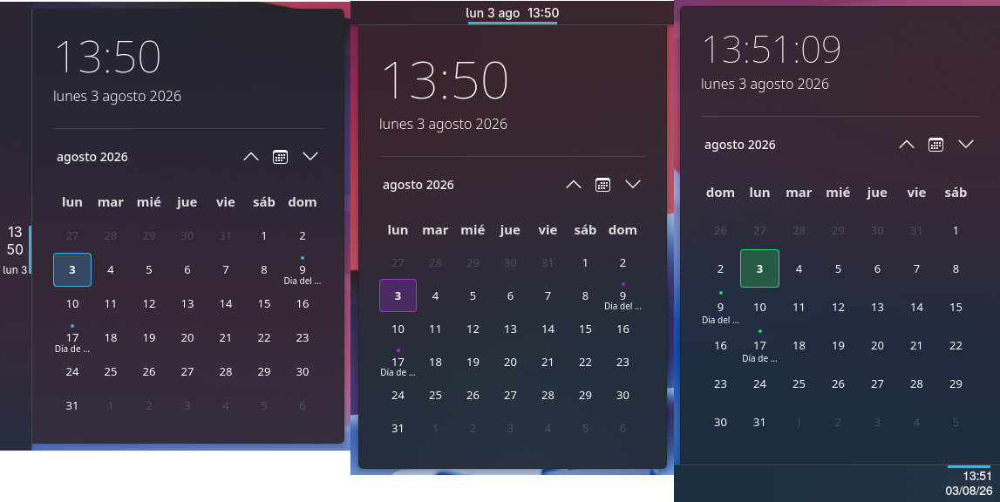
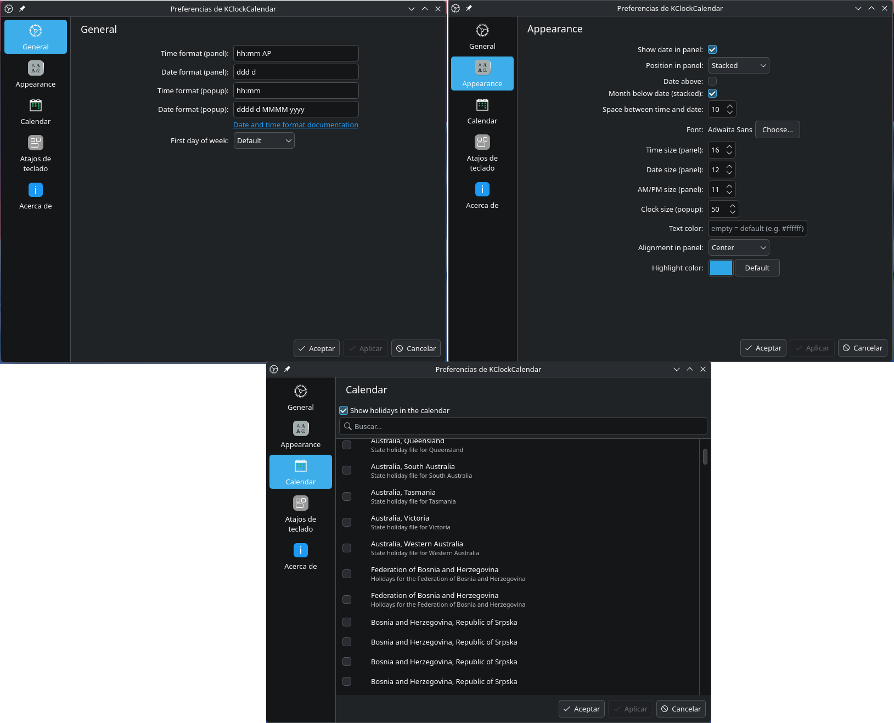

# KClockCalendar

Customizable clock and calendar for KDE Plasma 6.

## Screenshots

## Configuration

## Features

- Customizable clock on the panel: any date/time format, 12h or 24h, with or
  without seconds (the clock only ticks each minute when seconds aren't shown).
- Optional date next to the clock, with its own format.
- Flexible layouts: vertical, horizontal or stacked, with configurable
  time/date order, month placement and spacing.
- Full appearance control: font, sizes for time, date, AM/PM and the popup
  clock, text color and alignment, and calendar highlight color.
- Popup with a large clock and date, plus a monthly calendar.
- Calendar navigation: month slider, click the title to switch to a year
  (month grid) view, and a "jump to today" button.
- Holidays from KHolidays, with region selection and a searchable, filterable
  region list.
- Configurable first day of the week (defaults to your locale).
- Tooltip showing the current time and date.
