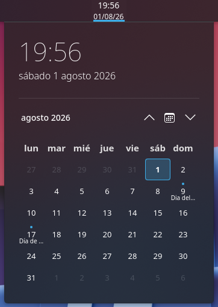
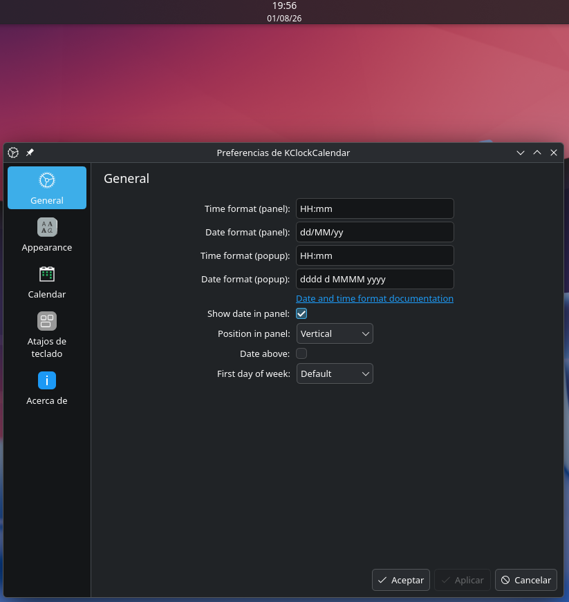
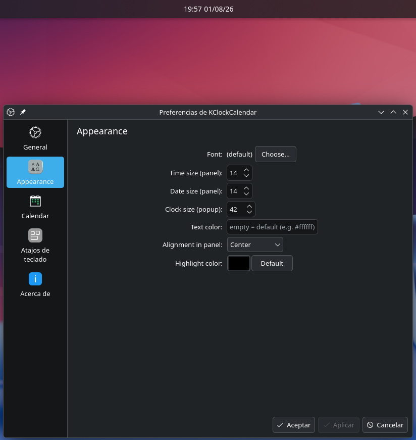
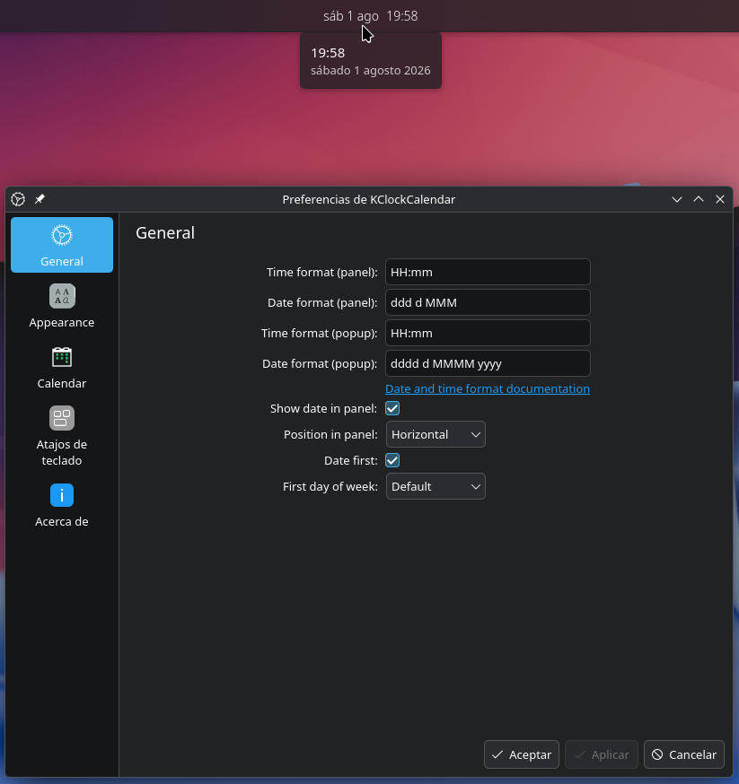

# KClockCalendar

Customizable clock and calendar for KDE Plasma 6.

## Screenshots

## Configuration

## Features

- Panel clock with configurable format (12/24h, with or without seconds).
- Monthly calendar with month view and jump to today.
- Holidays (calendar events).
- Customization of fonts, sizes, colors and alignment.
- Configurable text and date position on the panel.
